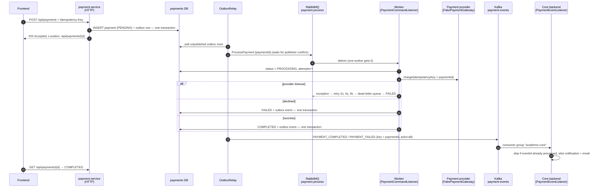

# Payment Service

A small microservice that takes student fee payments. It exists to show how **RabbitMQ** and
**Kafka** work together in a real system, with each one doing the job it is best at.

- **RabbitMQ** carries *commands*: "charge this payment". One worker does each job, with retries
  and a dead-letter queue.
- **Kafka** carries *events*: "this payment completed / failed". The event is kept, and any number
  of services can read it, now or later.

## The flow



## Why two brokers?

|                         | RabbitMQ (commands)                              | Kafka (events)                                          |
|-------------------------|--------------------------------------------------|---------------------------------------------------------|
| Message means           | "Please do this"                                 | "This happened"                                         |
| After it's consumed     | Deleted once acknowledged                        | Kept for the retention period; can be re-read           |
| Several consumers       | *Compete*: each message goes to ONE worker       | *Fan out*: every consumer group gets EVERY event        |
| Failure handling        | Per-message retry, then dead-letter queue        | Consumer controls its offset; retry, then `.DLT` topic  |
| In this project         | Queue `payment.process` (+ `payment.process.dlq`) | Topic `payment-events` (3 partitions, keyed by payment) |

Think of RabbitMQ as a shared to-do list that the cashiers work through. Kafka is more like the
bank statement: anyone allowed can read it, from any point in time. Tomorrow an accounting or
analytics service can subscribe to `payment-events` with its own group id and read the whole
history, and neither this service nor the core backend has to change.

## Real-world patterns in the code

| Problem                                                         | Pattern                                                            | Where |
|-----------------------------------------------------------------|--------------------------------------------------------------------|-------|
| The charge takes seconds and can fail; don't block the HTTP call | `202 Accepted` + `Location` to poll                                | `PaymentController` |
| Double-click / network retry must not pay twice                 | `Idempotency-Key` header, unique per student                       | `PaymentService.create` |
| "Saved to DB but crashed before sending to the broker"          | **Transactional outbox**: the message row commits with the data     | `OutboxEvent`, `OutboxRelay` |
| "Sent, but did the broker really store it?"                     | RabbitMQ publisher confirms; Kafka `acks=all` + idempotent producer | `OutboxRelay`, `application.properties` |
| Spread slow jobs across workers fairly                          | Competing consumers, `prefetch=1`, concurrency 2–4                  | `application.properties` |
| Provider timeouts                                               | Retry with exponential backoff, then **dead-letter queue**          | `application.properties`, `onDeadLetter` |
| Declined card ≠ outage                                          | Permanent failures are not retried; transient ones are              | `PaymentCommandListener` |
| Retrying after a timeout where the charge actually went through | Payment id passed to the provider as its idempotency key            | `FakePaymentGateway` |
| DB connections held during slow network calls                   | Short transactions before/after the provider call, none during it   | `PaymentService.startProcessing` / `markCompleted` |
| Same event delivered twice (at-least-once)                      | **Idempotent consumer** (inbox table keyed by `eventId`)           | core: `PaymentEventListener`, `ProcessedEvent` |
| One poison event blocking the partition                         | 3 retries, then `payment-events.DLT`                                | core: `KafkaConsumerConfig` |
| Services must not share a database                              | Own Postgres on port 5433; the core backend learns only via events  | `docker-compose.yml` |
| Services must deploy independently                              | JSON contract, local copies of the event class, unknown fields ignored | both `PaymentEvent` records |
| Auth without calling the core backend                           | JWT validated locally with the shared secret; claims trusted       | `JwtAuthFilter` |

## Run it locally

You need Docker Desktop, JDK 17 and Maven.

```powershell
# 1. Infrastructure: payments Postgres (5433), RabbitMQ (5672 / UI 15672), Kafka (9092), Kafka UI (8090)
docker compose up -d

# 2. The payment service (port 8081)
cd payment-service
mvn spring-boot:run

# 3. The core backend, with the Kafka consumer switched on (port 8000)
#    Once, on an existing database: psql -d actionlearning -f db/migrations/V002__payment_notification_types.sql
$env:PAYMENTS_KAFKA_ENABLED = "true"
mvn spring-boot:run
```

To run the payment service in Docker too, use `docker compose --profile app up -d --build`.

Dashboards:
- RabbitMQ: <http://localhost:15672> (`payment` / `payment`). See **Queues → payment.process / payment.process.dlq**.
- Kafka UI: <http://localhost:8090>. See **Topics → payment-events → Messages**, and **Consumers** for lag.

## Try it

Log in as any demo student. The password is `Password@123`, and emails look like
`lastname-firstname@<university-domain>`.

```powershell
$login   = Invoke-RestMethod -Method Post http://localhost:8000/api/auth/login -ContentType 'application/json' `
             -Body '{"email":"<student-email>","password":"Password@123"}'
$headers = @{ Authorization = "Bearer $($login.token)"; 'Idempotency-Key' = [guid]::NewGuid().ToString() }
$body    = '{"amount":1500.00,"currency":"EUR","description":"Semester 1 tuition","paymentMethod":"pm_card_visa"}'

$payment = Invoke-RestMethod -Method Post http://localhost:8081/api/payments -Headers $headers -ContentType 'application/json' -Body $body
$payment.status                                                          # PENDING
Start-Sleep 3
(Invoke-RestMethod "http://localhost:8081/api/payments/$($payment.id)" -Headers $headers).status   # COMPLETED
Invoke-RestMethod http://localhost:8000/api/notifications/me -Headers $headers                     # "Your payment of 1500.00 EUR ... was successful"
```

Experiments (change `paymentMethod`, or what's running):

| Do this                                                                         | You'll see |
|---------------------------------------------------------------------------------|------------|
| `pm_card_visa`                                                                  | PENDING → PROCESSING → COMPLETED in ~2 s; a notification in the core app |
| `pm_card_declined`                                                              | FAILED right away, attempt 1 only: no point retrying a decline |
| `pm_card_flaky`                                                                 | Worker log: attempts 1 and 2 time out, attempt 3 succeeds (after 2 s, then 4 s) |
| `pm_card_gateway_down`                                                          | 4 attempts, then the message appears in `payment.process.dlq`, and the payment becomes FAILED |
| Send the same request again with the same `Idempotency-Key`                     | Same payment id comes back; nothing is charged twice |
| Stop the core backend, make 3 payments, start it again                          | It catches up on all 3: Kafka kept them. Watch the consumer lag drop in Kafka UI |
| `docker compose stop rabbitmq`, pay, then `docker compose start rabbitmq`        | Payment stays PENDING (the command waits in the outbox), then processes once RabbitMQ is back |
| Read the topic as a brand-new consumer group (below)                            | Every past event, without affecting the core backend's position |

```powershell
docker compose exec kafka /opt/kafka/bin/kafka-console-consumer.sh `
  --bootstrap-server localhost:9092 --topic payment-events --from-beginning --group audit-demo
```

## What is simplified compared with production

- **Payment provider.** `FakePaymentGateway` stands in for Stripe/Adyen. A real one also confirms payments asynchronously through **webhooks** (e.g. after 3-D Secure), which would be one more input to the worker.
- **Amount.** It comes from the request here. In production the server derives it from an invoice or fee schedule; never trust a client-supplied price.
- **Auth.** Both services share the HS256 secret. In production you'd use RS256 with a public JWKS endpoint (only the core backend holds the private key), or an API gateway that validates tokens.
- **Outbox relay.** It polls, and assumes a single instance. With several instances, claim rows using `SELECT … FOR UPDATE SKIP LOCKED`, or replace polling with CDC (Debezium).
- **Retries.** They happen inside the listener, which blocks a worker thread during the backoff. At high volume, use delayed retry queues (TTL + dead-letter back to the main queue).
- **Schema.** It's managed by `ddl-auto=update`. Use Flyway/Liquibase migrations in production.
- **Kafka.** One broker with replication factor 1. Production runs 3+ brokers, RF 3, `min.insync.replicas=2`.
- **Routing.** There's no API gateway; the frontend calls port 8081 directly. Usually a gateway routes `/api/payments/**` here and everything else to the core backend.

## Code map

```
payment-service/src/main/java/fr/epita/payment/
├── controller/PaymentController.java     POST /api/payments, GET /me, GET /{id}, GET (uni admin)
├── service/PaymentService.java           state changes + outbox writes, each in one transaction
├── messaging/
│   ├── OutboxRelay.java                  outbox → RabbitMQ / Kafka, with broker confirmation
│   ├── PaymentCommandListener.java       RabbitMQ worker + dead-letter handler
│   ├── ProcessPaymentCommand.java        RabbitMQ message
│   └── PaymentEvent.java                 Kafka message (the contract)
├── gateway/FakePaymentGateway.java       simulated provider (test tokens above)
├── config/RabbitConfig.java              exchange, queue, DLX, DLQ, JSON converter
├── config/KafkaConfig.java               payment-events topic
├── model/  repository/  dto/  security/  exception/

src/main/java/fr/epita/   (core backend)
├── messaging/PaymentEventListener.java   Kafka consumer → student notification + email
├── messaging/PaymentEvent.java           core's copy of the contract
├── model/ProcessedEvent.java             inbox table for de-duplication
└── config/KafkaConsumerConfig.java       retries + dead-letter topic
```
